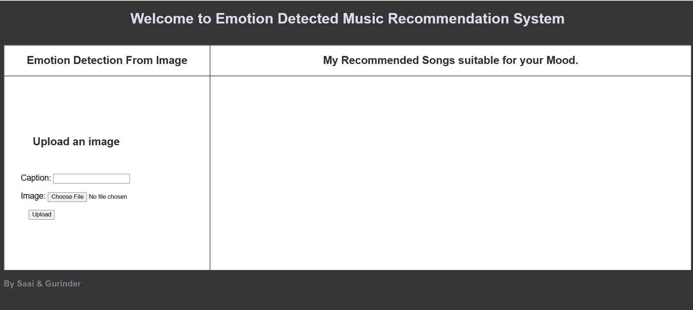
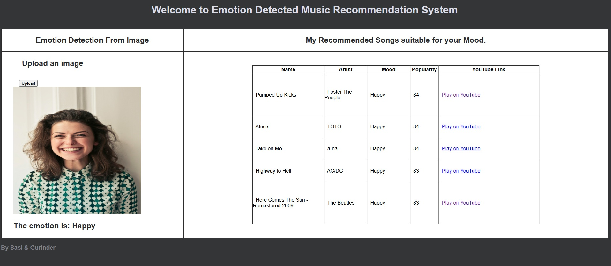

# 🎵 Emotion-Based Music Recommender System

---

## 🔹 Project Overview

This web application allows users to **upload an image**, detects the **emotion** of the person using a **Convolutional Neural Network (CNN)**, and then **recommends songs** based on the detected emotion. Each recommended song includes a link to watch it on **YouTube**.  

The system demonstrates integration of **Computer Vision, Machine Learning, and Web Development** in a user-friendly interface.

---

## 🔹 Features

- **Emotion Detection**: Detects emotions like *happy, sad, angry, surprised, neutral*, etc.  
- **Song Recommendation**: Suggests songs aligned with the detected emotion.  
- **YouTube Links**: Direct links to watch songs.  
- **Web Interface**: Built with Django, HTML, CSS, and JavaScript.

---

## 🔹 Demo

1. **Upload an image**  
  

2. **Emotion detected**   &&  **Song recommendations**  
  

---

## 🔹 Tech Stack & Skills

- **Frontend**: HTML, CSS, JavaScript  
- **Backend**: Django (Python)  
- **Machine Learning**:
  - CNN for emotion detection  
  - OpenCV for image preprocessing  
- **Libraries & APIs**: TensorFlow / Keras, YouTube API (optional)  
- **Other Skills**: OOP in Python, file uploads, dynamic content rendering  

---

## 🤝 Contributing

Contributions are welcome! Open an issue or submit a pull request to improve the project.

---

## 🚀 Future Improvements

- Add more emotions and larger song database  
- Integrate **YouTube API** to directly play songs  
- Add **movie recommendations** based on detected emotion  
- Improve **UI/UX for mobile responsiveness**
